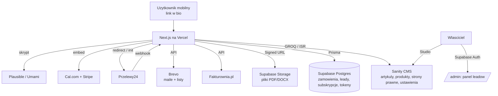

# Projekt techniczny (Design) — Smart Obywatel

> Dokument bazuje na zaakceptowanym `requirements.md`. Opisuje rekomendowany stack,
> architekturę, model danych, integracje, kluczowe przepływy, system wizualny oraz
> podejście do wydajności, SEO, RODO i dostępności. Wymaga akceptacji przed
> przejściem do `tasks.md`.

## 1. Przegląd i zasady projektowe

Serwis to **hybryda treść + narzędzia + transakcje**, mobile-first, z priorytetem
na szybkość i SEO. Kluczowe zasady:

- **Treść statyczna/prerenderowana** (artykuły, sklep, strony prawne) → maksymalna
  szybkość i SEO.
- **Interaktywność wyspowa** — kalkulatory i formularze ładowane tam, gdzie są
  potrzebne, żeby nie obciążać stron treściowych JS-em.
- **Integracje przez wąskie warstwy adaptera** — dostawca płatności, e-mail,
  fakturowanie i analityka są za interfejsami, żeby wymiana (np. Przelewy24 ↔ Tpay,
  osoba prywatna ↔ JDG) była kwestią konfiguracji, nie przepisywania kodu.
- **Dane PII w bazie pod naszą kontrolą (UE)**, treść edytowalna w CMS bez developera.
- **Gotowość na konta użytkowników** — model danych i warstwa auth wybrane tak, by
  późniejsze dodanie logowania i „Moich zakupów" nie wymagało migracji burzącej dane.

## 2. Rekomendowany stack technologiczny

| Warstwa | Rekomendacja | Uzasadnienie |
|---|---|---|
| Framework | **Next.js (App Router) + TypeScript** | SSG/ISR + SSR, świetne SEO, API routes na webhooki, natywna optymalizacja obrazów, idealny pod Vercel |
| Hosting | **Vercel** | Zgodnie z decyzją; edge/CDN, ISR, łatwe env/secrets |
| Styling / UI | **Tailwind CSS + shadcn/ui (Radix UI)** | Szybki, spójny system wizualny; Radix daje dostępność (WCAG AA / EAA) „z pudełka" |
| CMS treści | **Sanity** | Zgodnie z decyzją; GROQ, Studio dla autora, edytowalne ustawienia (singleton) |
| Baza danych | **Supabase (PostgreSQL, region EU)** | Postgres na dane transakcyjne/PII + wbudowany Auth (panel leadów teraz, konta użytkowników w przyszłości) + Storage na pliki |
| ORM / migracje | **Prisma** (alternatywa: Drizzle) | Typowane modele, migracje, czytelny schemat |
| Pliki (produkty, lead magnet) | **Supabase Storage — bucket prywatny** | Signed URL o krótkim czasie życia; dostęp tylko przez nasz endpoint po walidacji tokenu |
| Płatności sklep | **Przelewy24** (adapter `PaymentProvider`) | BLIK + karta + przelew; szeroka adopcja w PL; Tpay jako alternatywa za tym samym interfejsem |
| Fakturowanie | **Fakturownia.pl API** | Auto-dokument sprzedaży przy każdym zakupie; przełączenie os. prywatna → JDG w ustawieniach |
| Konsultacje | **Cal.com + Stripe** (embed) | Płatność przed rezerwacją, potwierdzenia i kalendarz po stronie Cal.com |
| E-mail | **Brevo** (transactional API + listy) | Double opt-in, e-maile transakcyjne (zakup, lead magnet), przekazanie leada |
| Analityka | **Plausible (Cloud EU)** lub **Umami (self-host)** | Privacy-first, lekki skrypt, minimalny/zerowy baner cookies |
| Uwierzytelnienie (panel leadów) | **Supabase Auth** (konto właściciela) | Ochrona danych osobowych; ta sama warstwa obsłuży konta użytkowników w przyszłości |

## 3. Architektura wysokopoziomowa



## 4. Model danych

### 4.1 Sanity (treść — edytowalna bez developera)

**`article`**
| Pole | Typ | Uwagi |
|---|---|---|
| title | string | H1 / meta bazowe |
| slug | slug | czysty URL, unikalny w obrębie filaru |
| pillar | reference → `pillar` | Kariera / Prawo Pracy / Prawa Konsumenta |
| excerpt | text | lista, OG |
| body | portable text | nagłówki H2/H3, obrazy, osadzenia |
| heroImage | image | responsywne warianty |
| relatedProducts | array<reference → `product`> | produkty pokazywane w artykule |
| relatedCalculator | string (enum) | `odprawa` / `ekwiwalent` / `szkoda-calkowita` / brak |
| seo | object | metaTitle, metaDescription, ogImage |
| publishedAt / updatedAt | datetime | dla `Article` schema |
| author | reference → `author` | |

**`product`**
| Pole | Typ | Uwagi |
|---|---|---|
| title | string | |
| slug | slug | URL w sklepie |
| price | number | w groszach (PLN) |
| shortDescription | text | „co zawiera i kiedy użyć" |
| previewContent | portable text / image[] | podgląd fragmentu przed zakupem (wym. 4.2) |
| storageKey | string | klucz pliku w Supabase Storage (plik NIE w Sanity) |
| fileFormat | string | PDF / DOCX |
| category | reference → `pillar` | |
| relatedCalculator | string (enum) | powiązanie z kalkulatorem |
| seo | object | |

**`pillar`** — title, slug, opis, kolor (do kodowania kolorem w UI).
**`author`** — name, bio, avatar.
**`legalPage`** — title, slug, body (osadzenie treści od prawnika).
**`settings` (singleton, edytowalne przez właściciela)**
| Pole | Uwagi |
|---|---|
| equivalentCoefficient | współczynnik ekwiwalentu za urlop (wym. 3.10/3.11) |
| minimumWage | do limitu 15× w kalkulatorze odprawy |
| defaultPartnerCode | domyślny kod partnera dla leadów (wym. 5.5) |
| newsletterPopupCooldownDays | częstotliwość pop-upu |
| consultationOffer | opis + cennik konsultacji (lub link Cal.com) |

> Wartości „prawne" (współczynnik, min. wynagrodzenie) trzymane w CMS = właściciel
> aktualizuje je bez developera i bez zmian w kodzie.

### 4.2 Supabase / Postgres (dane transakcyjne i PII)

**`orders`**
```
id (uuid, pk)
product_sanity_id (text)          -- referencja do produktu w Sanity
product_title (text)              -- snapshot na moment zakupu
amount (int, grosze) / currency ('PLN')
buyer_email (text) / buyer_name (text)
wants_company_invoice (bool)
company_nip (text, null) / company_name (text, null)
payment_provider (text)           -- 'przelewy24' | 'tpay'
payment_ref (text)                -- id sesji/transakcji u operatora
status (enum: pending|paid|failed|refunded)
invoice_id (text, null)           -- id dokumentu z Fakturowni
created_at / paid_at (timestamptz)
user_id (uuid, null)              -- ZAWSZE null w MVP; miejsce pod przyszłe konta
```

**`download_tokens`** (tylko sklep)
```
id (uuid) / order_id (fk → orders)
token_hash (text)                 -- token wysyłany w linku, w bazie hash
expires_at (timestamptz)          -- paid_at + 72h
max_downloads (int, default 3) / download_count (int, default 0)
created_at
```

**`leads`**
```
id (uuid)
case_type (text) / description (text)
name (text) / email (text) / phone (text, null)
utm_source/utm_medium/utm_campaign/utm_content/utm_term (text, null)
partner_code (text)               -- z URL lub defaultPartnerCode
status (enum: new|forwarded|in_contact|closed)
consent_at (timestamptz)          -- zgoda RODO
forwarded_at (timestamptz, null)  -- moment przekazania partnerowi
created_at
```

**`newsletter_subscribers`** (kontrola double opt-in i lead magnetu)
```
id (uuid) / email (text, unique)
status (enum: pending|confirmed|unsubscribed)
confirm_token_hash (text, null)
source (text)                     -- artykul / popup / kalkulator / stopka
consent_at / confirmed_at (timestamptz, null)
```
> Po potwierdzeniu kontakt jest synchronizowany do listy w Brevo. Brevo posiada
> też natywne DOI — celowo kontrolujemy potwierdzenie u siebie, aby precyzyjnie
> powiązać je z wydaniem lead magnetu.

**`lead_magnet_tokens`** (osobny mechanizm — NIE reużywa tokenów sklepu, wym. 7.3/7.4)
```
id (uuid) / email (text)
token_hash (text)
storage_key (text)                -- plik darmowego wzoru
expires_at (timestamptz)          -- created_at + 30 dni
created_at
-- brak limitu pobrań
```

**Panel leadów / admin** — konto właściciela w Supabase Auth; dostęp do `/admin`
chroniony (wym. 5.9–5.11).

## 5. Kluczowe przepływy

### 5.1 Zakup produktu cyfrowego

```mermaid
sequenceDiagram
    participant U as Uzytkownik
    participant N as Next.js
    participant P as Przelewy24
    participant DB as Postgres
    participant F as Fakturownia
    participant B as Brevo

    U->>N: Checkout (email, [firma+NIP])
    N->>DB: order status=pending
    N->>P: init platnosci (BLIK/karta/przelew)
    U->>P: oplaca
    P-->>N: webhook (podpisany)
    N->>P: weryfikacja transakcji (potwierdzenie po stronie serwera)
    N->>DB: order status=paid, generuj download_token (72h/3)
    N->>F: wystaw dokument sprzedazy (auto; dane firmy jesli podane)
    N->>B: e-mail transakcyjny z linkiem do pobrania
    U->>N: klik link -> walidacja tokenu -> signed URL do pliku
```

Endpoint pobrania sprawdza: token istnieje, `expires_at` > now, `download_count <
max_downloads`; jeśli warunek niespełniony → strona z opcją „wyślij ponownie"
(regeneracja tokenu i ponowny e-mail).

### 5.2 Lead magnet (newsletter double opt-in)

```mermaid
sequenceDiagram
    participant U as Uzytkownik
    participant N as Next.js
    participant DB as Postgres
    participant B as Brevo

    U->>N: zapis (email + zgoda RODO)
    N->>DB: subscriber status=pending + confirm_token
    N->>B: e-mail potwierdzajacy (DOI)
    U->>N: klik link potwierdzajacy
    N->>DB: status=confirmed; generuj lead_magnet_token (30 dni, bez limitu)
    N->>B: sync kontaktu do listy newslettera
    N-->>U: strona z bezposrednim pobraniem + link w mailu
```

### 5.3 Lead afiliacyjny

Formularz → walidacja + zgoda RODO → odczyt UTM i `partner_code` z URL (fallback:
`defaultPartnerCode` z ustawień) → zapis `leads` → auto e-mail do partnera (Brevo) →
lead widoczny w panelu `/admin` ze zmienialnym statusem.

### 5.4 Konsultacje

Strona oferty/cennika → embed Cal.com z aplikacją Stripe → płatność przed
rezerwacją → potwierdzenie i kalendarz obsługiwane przez Cal.com.

### 5.5 Kalkulatory

Obliczenia w całości po stronie klienta (React, bez wysyłki danych obliczeniowych).
Parametry „prawne" (współczynnik, min. wynagrodzenie) pobierane z `settings` (Sanity)
w czasie budowania/ISR. Opcja „wyślij wynik na e-mail" wymaga zgody RODO i wpina się
w przepływ newslettera (double opt-in).

## 6. Integracje — warstwy adapterów

- **`PaymentProvider`** (interfejs): `createPayment()`, `verifyWebhook()`,
  `confirmTransaction()`. Implementacja `Przelewy24Provider`; `TpayProvider` możliwa
  bez zmian w logice sklepu. Wybór przez zmienną środowiskową.
- **`InvoiceService`** (Fakturownia): dane sprzedawcy i typ dokumentu w konfiguracji —
  przejście os. prywatna → JDG bez zmian w kodzie.
- **`EmailService`** (Brevo): `sendTransactional()`, `upsertContact()`, `addToList()`.
- **`Analytics`**: pojedynczy komponent skryptu (Plausible/Umami) przełączany env.

Wszystkie sekrety (klucze API, webhook secrets) w zmiennych środowiskowych Vercel.
Webhooki weryfikowane podpisem + potwierdzeniem transakcji po stronie serwera
(nigdy nie ufamy samemu wywołaniu webhooka).

## 7. Struktura tras (App Router)

```
/                         strona glowna (3 filary, case studies, produkty, CTA)
/[pillar]                 lista artykulow w filarze (filtr kategorii)
/[pillar]/[slug]          artykul (Article schema, powiazane produkty/kalkulator)
/kalkulatory              rozdzielnik
/kalkulatory/odprawa
/kalkulatory/ekwiwalent-urlop
/kalkulatory/szkoda-calkowita
/sklep                    katalog produktow (Product schema)
/sklep/[slug]             produkt + podglad fragmentu + zakup
/pobierz/[token]          walidacja tokenu sklepu -> plik / "wyslij ponownie"
/newsletter/potwierdz     obsluga DOI + wydanie lead magnetu
/pobierz-wzor/[token]     pobranie lead magnetu (30 dni, bez limitu)
/ekspert                  formularz leadowy
/konsultacje              oferta + embed Cal.com
/[legal-slug]             strony prawne (z CMS)
/admin                    panel leadow (Supabase Auth)
/api/webhooks/payments    webhook operatora platnosci
/api/...                  pozostale endpointy (newsletter, lead, download)
sitemap.xml, robots.txt
```

## 8. Propozycja systemu wizualnego

Cel: **prosto, konkretnie, wiarygodnie — odwrotność biurokracji.** Ciepły, ludzki,
ale kompetentny. Poniżej propozycja do akceptacji/modyfikacji (brak jeszcze logo/
kolorów — to punkt wyjścia).

**Osobowość marki:** pomocny przewodnik, mówi prostym językiem, po Twojej stronie.
Nie „kancelaria", nie „korpo" — raczej „mądry znajomy, który zna się na prawie".

**Paleta (propozycja):**
| Rola | Kolor | Hex |
|---|---|---|
| Primary (zaufanie, spokój) | głęboki morski/teal | `#0F766E` |
| Accent / CTA (energia, działanie) | ciepły bursztyn | `#F59E0B` |
| Tło | ciepła biel / kość słoniowa | `#FBFAF7` |
| Tekst | grafit (nie czysta czerń) | `#1F2937` |
| Sukces / pozytyw | zieleń | `#16A34A` |
| Ostrzeżenie / disclaimer | stonowany amber/red | `#B45309` |

**Kodowanie filarów kolorem** (spójne odznaki/kategorie):
- Kariera — indygo/niebieski,
- Prawo Pracy — teal (primary),
- Prawa Konsumenta — bursztyn/pomarańcz.

**Typografia:**
- Nagłówki: **Fraunces** (ciepły, „redakcyjny" serif — buduje zaufanie i ludzki ton)
  lub alternatywnie mocny grotesk (np. Space Grotesk).
- Tekst: **Inter** (wysoka czytelność, świetny na mobile).

**Reguła kontrastu bursztynu (WCAG AA):** bursztyn `#F59E0B` **nie przechodzi**
AA jako kolor tekstu na jasnym tle (~2:1). Dlatego:
- bursztyn używany jest jako **wypełnienie** (tło CTA, odznaki) z **ciemnym
  tekstem grafitowym `#1F2937`** na wierzchu (przechodzi AA), nigdy jako jasny
  tekst na bieli;
- gdy potrzebny jest **bursztynowy tekst/link** na jasnym tle, używamy
  ciemniejszego wariantu `#B45309` (amber-700), który przechodzi AA;
- focus ring i obramowania mogą być bursztynowe, ale komunikaty tekstowe — nie
  w jasnym bursztynie.

**Elementy UI:** umiarkowanie zaokrąglone rogi, wyraźne pojedyncze CTA, karty
produktów/artykułów, widoczne odznaki filarów, ikonografia **lucide**. Disclaimery
w spójnym, nieprzytłaczającym, ale zawsze widocznym stylu (pasek/kartka w stopce
treści prawnych i kalkulatorów).

**Dostępność (MUSI, EAA):** komponenty Radix/shadcn, kontrast ≥ AA, focus ring,
pełna obsługa klawiatury, etykiety i komunikaty błędów w formularzach, semantyczne
nagłówki, obsługa czytników ekranu.

## 9. SEO

- Statyczny/ISR render treści; `generateMetadata` per strona (title, description, OG).
- Structured data JSON-LD: `Organization`/`WebSite` (home), `Article` (blog),
  `Product`/`Offer` (sklep).
- Dynamiczny `sitemap.xml` (z Sanity + tras statycznych) i `robots.txt`.
- Czyste, czytelne, hierarchiczne URL-e (`/prawo-pracy/…`, `/sklep/…`).
- Semantyczny HTML + Open Graph / Twitter Card do udostępnień w social.

## 10. Wydajność

- Prerender treści (SSG/ISR), minimalny JS na stronach treściowych.
- Kalkulatory i pop-up jako komponenty ładowane dynamicznie (`next/dynamic`).
- `next/image` (AVIF/WebP, responsywne rozmiary), lazy-loading.
- Cel: LCP < 2,5 s, CLS < 0,1, INP < 200 ms na mobile; budżet JS pilnowany.
- Fonty przez `next/font` (self-host, `font-display: swap`).

## 11. Bezpieczeństwo i RODO

- HTTPS wszędzie; sekrety w env Vercel; webhooki weryfikowane podpisem + potwierdzenie
  transakcji po stronie serwera.
- Tokeny pobrań przechowywane jako **hash**; pliki w prywatnym buckecie, udostępniane
  tylko przez signed URL po walidacji.
- Zgody RODO zapisywane z czasem i źródłem; informacja o odbiorcy danych (partner)
  przy formularzu leadowym.
- Analityka privacy-first (bez profilowania) → minimalny/zerowy baner cookies;
  gdyby doszło narzędzie wymagające zgody — baner zgód respektujący wybór.
- Dane PII w regionie **UE** (Supabase EU). Ścieżka realizacji praw (dostęp/usunięcie)
  po stronie panelu/administracji.
- Panel `/admin` za uwierzytelnieniem (Supabase Auth), dostęp tylko dla właściciela.

## 12. Rozszerzalność do kont użytkowników

- `orders.user_id` istnieje od początku (null w MVP) — po dodaniu kont wystarczy
  powiązać zamówienia z kontem po e-mailu.
- Auth (Supabase) już obecny dla panelu — te same mechanizmy obsłużą logowanie
  klientów i stronę „Moje zakupy" bez migracji burzącej dane.

## 13. Zmienne środowiskowe (zarys)

```
SANITY_PROJECT_ID / SANITY_DATASET / SANITY_API_TOKEN
DATABASE_URL (Supabase) / SUPABASE_URL / SUPABASE_SERVICE_ROLE_KEY / SUPABASE_ANON_KEY
PAYMENT_PROVIDER=przelewy24
P24_MERCHANT_ID / P24_POS_ID / P24_CRC / P24_API_KEY
FAKTUROWNIA_API_TOKEN / FAKTUROWNIA_DOMAIN
BREVO_API_KEY / BREVO_NEWSLETTER_LIST_ID / PARTNER_LEAD_EMAIL
CALCOM_EMBED / STRIPE_* (po stronie Cal.com)
NEXT_PUBLIC_ANALYTICS_DOMAIN (Plausible/Umami)
```

## 14. Zatwierdzone decyzje

1. **Operator płatności:** **Przelewy24** jako jedyna bramka na start; adapter
   `PaymentProvider` gotowy na dodanie Tpay bez zmian w logice sklepu.
2. **Baza danych / auth / storage:** **Supabase** (Postgres + Auth + Storage) —
   jedno miejsce na dane transakcyjne, panel leadów i przyszłe konta użytkowników.
3. **Analityka:** **Plausible Cloud (EU)** — zero utrzymania, hosting w UE, bez
   banera cookies.
4. **System wizualny:** **Fraunces (nagłówki) + Inter (tekst)**, paleta teal
   `#0F766E` + bursztyn `#F59E0B` — z regułą kontrastu bursztynu (patrz sekcja 8).
5. **Konsultacje:** **Cal.com Cloud** (plan darmowy na start) + Stripe;
   self-host odrzucony jako nieprodukcyjny.
6. **Panel leadów:** lista + zmiana statusu + filtr **oraz eksport CSV** już w
   pierwszej wersji panelu.
